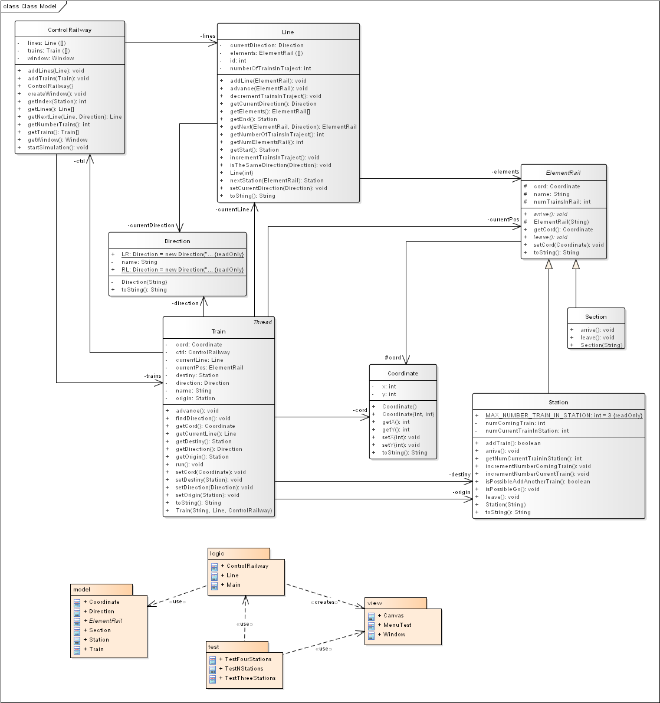

#### Authors
	SANTOS Daniel
	SANYAS Guillem
#### Description Project
	Simulation of Stations and Trains

#### Description of the repository
The source code was created from scratch

 - src/
  - Contains all the source code as well as the assets to run it
 - bin/
  - Binary files
 - assets/
  - Contains the static diagram of the code and the image of the GUI description

### Diagram
The below diagram shows the static diagram of the controller and model of the application.



### Instructions
In the following image you can see the different elements that are shown in the graphic interface, check them for a better comprenhension of the simulation.


#### Code Description
The project was based in the architectural pattern Model - View  - Controller in which our model is src/model, our controllers are located in src/logic  and our view  components are in src/view.

#### How to test the code?
In logic/ there is a file called Main.java which is a Facade  for running the different simulation test created.

## French part for teachers - Réponses aux questions

### Exercice 1

#### Question 1.1

Rôle de chaque classe du diagramme proposé en cours pour le déplacement d'un train :

Railway : permet au train de connaitre sa prochaine destination (l'élément adjacent au sien et dans la bonne direction).

Element (Section et Station) : contrôleurs qui autorisent le train à passer dessus quand il y a de la place

Train : thread qui prend la décision d'avancer

Position : permet au train de connaitre sa prochaine destination

Direction : permet au train de connaitre sa prochaine destination

#### Question 1.2

Attributs à ajouter au diagramme de classe :

Railway : `-elements : Element[]`

Train : `-position : Position`


Méthodes à ajouter au diagramme de classe :

Railway : `+findNextElement(Position) : Element`

Train : `+move() : void`, `+run() : void`

Position : `+move() : void`

#### Question 1.3

##### Dans Railway

```
private int findIndexElement(Element e) {

	int i = -1;

	for (int j=0;j<elements.size();j++){

		if (elements[j]==e) i=j;

	}

	return i;

}
```

```
public Element findNextElement(Position p){

	int currentIndex = findIndexElement(p.element);

	Element e = (p.direction == Direction.LR) ? elements[currentIndex+1] : elements[currentIndex-1];

	return e;

}
```

##### Dans Train

```
public void move(){

	position.move();

}
```

```
public void run(){

	while(true){

		move();

		sleep(2000);

	}

}
```

##### Dans Position

```
public void move(){

	Element nextElement = element.railway.findNextElement(this);

	element = nextElement;

}
```

### Exercice 2

#### Question 2.2

Attributs à ajouter :

Station : `-nbTrains : int`

Section : `-hasTrain : boolean`

Attributs déjà existants à utiliser :

Station : `-size : int`

#### Question 2.3

Invariants de sécurité :

```
Station : nbTrains <= size

Section : nbTrains <= 1
```

#### Question 2.4

Actions critiques que peut effectuer un train :

```
Enter dans un élément.

Quitter un élément.
```

#### Questions 2.5, 2.6 et 2.7

Méthodes à ajouter :

Element : `+abstract enterElement() : void`, `abstract leaveElement() : void`

Station : `+enterElement() : void`, `+leaveElement(): void`, `-invariantStation(): boolean`

Section : `+enterElement() : void`, `+leaveElement(): void`, `-invariantSection(): boolean`


##### Dans Element

```
public abstract void enterElement();

public abstract void leaveElement();
```

##### Dans Station

```
private invariantStation(){

	// futur number of trains = nbTrains + 1

	return nbTrains + 1 <= size;

}
```

```
public synchronized void enterElement(){

	while (! invariantStation()){

		try{

			wait();

		} catch (InterruptedException e) {

			e.printStackTrace();

		}
	}

	nbTrains = nbTrains+1;

}
```

```
public synchronized void leaveElement(){

	nbTrains--;

	notifyAll();

}
```

##### Dans Section

```
private invariantSection(){

	// future state if there is no train = there is a train

	// future sate if there is already a train = there are two trains : breaks the invariant

	return ! hasTrains;

}
```

```
public synchronized void enterElement(){

	while (! invariantSection()) {

		try {

			wait();

		} catch (InterruptedException e) {

			e.printStackTrace();

		}

	}

	hasTrains = true;

}
```

```
public synchronized void leaveElement() {

	hasTrains = false;

	notifyAll();

}
```

#### Question 2.8

##### Dans Position

```
public void move(){

	Element nextElement = element.railway.findNextElement(this);

	nextElement.enterElement();

	element.leaveElement();

	element = nextElement;

}
```

### Exercice 3

#### Question 3.1

Attribut à ajouter

Railway : `-nbTrainsLeftRight : int`, `-nbTrainsRightLeft : int`

#### Question 3.2

Nouvelle condition :

```
Au moins une des deux variables est nulle.

nbTrainsLeftRight*nbTrainsRightLeft = 0
```

#### Question 3.3

Le railway se charge de la gestion de ces variables.

#### Question 3.4

##### Dans Railway

```
private boolean invariantRailway(futureNbTrainsLeftRight,futureNbTrainsRightLeft){

	return futureNbTrainsLeftRight*futureNbTrainsRightLeft == 0 ;

}
```

```
public synchronized void goingRight(){

	while (! invariantRailway(nbTrainsLeftRight + 1,nbTrainsRightLeft)){

		try{

			wait();

		} catch (InterruptedException e) {

			e.printStackTrace();

		}
	}

	nbTrainsLeftRight++;

}
```

```
public synchronized stopGoingRight(){

	nbTrainsLeftRight--;

	notifyAll();

}
```

```
public synchronized void goingLeft(){

	while (! invariantRailway(nbTrainsLeftRight,nbTrainsRightLeft + 1)){

		try{

			wait();

		} catch (InterruptedException e) {

			e.printStackTrace();

		}
	}

	nbTrainsRightLeft++;

}
```

```
public synchronized stopGoingLeft(){

	nbTrainsRightLeft--;

	notifyAll();

}
```

#### Question 3.5

##### Dans Section

```
public synchronized void enterElement(Direction dir){

	if (dir == Direction.LR){

		railway.goingRight();

	}

	else {

		railway.goingLeft();

	}

	while (! invariantSection()) {

		try {

			wait();

		} catch (InterruptedException e) {

			e.printStackTrace();

		}

	}

	hasTrains = true;

}
```

```
public synchronized void leaveElement(Direction dir) {

	if (dir == Direction.LR){

		railway.stopGoingRight();

	}

	else {

		railway.stopGoingLeft();

	}

	hasTrains = false;

	notifyAll();

}
```
